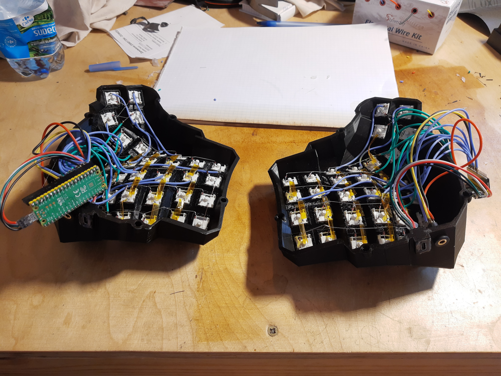

# dactyl_manuform_rp2040



## Intro

This is a dactyl_manuform on Raspberry Pi Pico guide.

For now you need to use my fork: https://github.com/GustawXYZ/qmk_firmware
Hopefully it will get merged and will be available in: https://github.com/qmk_firmware/qmk_firmware/tree/master/keyboards/handwired/dactyl_manuform_rp2040

## Build

I strived to make soldering as similar as possible to dactyl_manuform guide.

[abstracthat/dactyl-manuform](https://github.com/abstracthat/dactyl-manuform)

That means thay just swap following pins on the diagrams and you should be fine
for the ley matrix part.
Switched connections:

|ProMicro|PiPico|
|-|-|
|4|GP10|
|5|GP11|
|6|GP12|
|7|GP13|
|8|GP14|
|9|GP15|
|A1|GP21|
|A0|GP20|
|15|GP19|
|14|GP18|
|16|GP17|
|10|GP16|

I used a 4 pin jack 3.5mm connection. It uses SERIAL_USART_FULL_DUPLEX (whatever that means).

Conenctions are as following:

|Left PiPico|Right PiPico|
|-|-|
|3V3|3V3|
|GND|GND|
|GP9|GP8|
|GP8|GP9|

GP8 and GP9 are switch in "X" pattern, so that TX and RX are switched on the other board.

To use you need to set up qmk_firmware as per here: https://docs.qmk.fm/#/newbs_building_firmware

If my fork is not yet merged you need to use `qmk clone` to use it.

## FLASHING

Next proceed with the following commands for a simple update/flash:

```bash
cd ~/qmk_firmware/keyboards/handwired/dactyl_manuform_rp2040 &&
qmk flash
```
This should build the firmware and try flashing it.
When qmk says "waiting for drive" unplug your keyboard, then plug it back again while holding RESET button on the Pi Pico.
It should show up in your file manager, if needed mount it e.g. by clicking on it in Thunar File Manager.
QMK then should automatically pick it up and complete.

## Setting EPROM

If this is your first flash use the following for setting up the EPROM so the keyboard knows which is left and which is right half.
```bash
qmk flash -bl uf2-split-left
```
Plug left half while holding RESET.
```bash
qmk flash -bl uf2-split-right
```
Plug right half while holding RESET.

## With QMK Configurator

This will be only available after the fork is merged.

1. Go to [QMK Configurator](config.qmk.fm/)
1. Create you keymap
1. Download the .json
1. run `qmk flash my-file.json`
1. When qmk says waiting for the drive, unplug your keyboard, plug it while holding RESET and mount the drive (repeat for other half)
